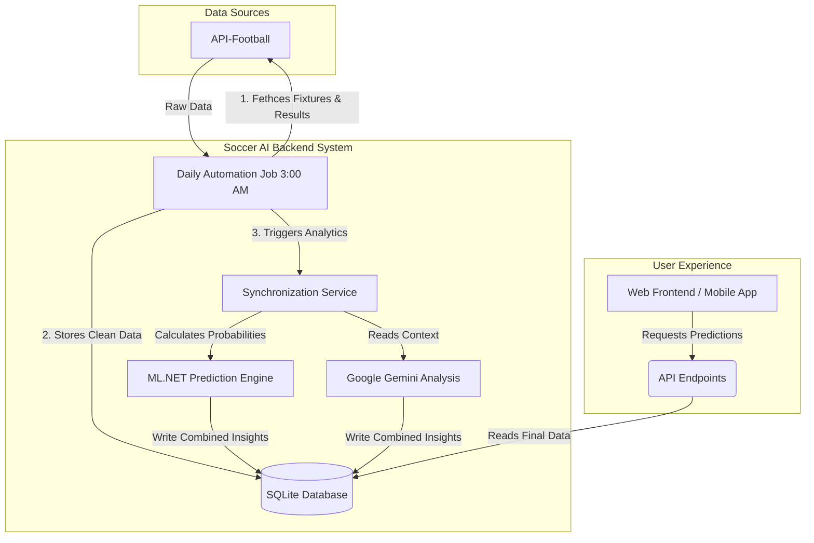

# Soccer AI - API Documentation

Welcome to the internal system architecture documentation for Soccer AI! Below is a high-level explanation of how the platform operates on a daily basis.

---

## High-Level System Flow (Visual Diagram)

The following diagram illustrates how raw football data is transformed into AI-generated predictions without requiring any developer intervention:

---

## Core API Capabilities

The backend exposes several distinct "areas" of endpoints that the frontend App can safely query:

### 1. Automation (`/api/automation`)
Automates the system background state.
- **Sync Daily Data**: Pulls yesterday's results to determine if predictions won or lost. Next, it downloads today's active fixtures.
- **Trigger Analytics**: Processes the ingested matches using mathematical probability (Poisson distribution) and Machine Learning (ML.NET). Generates human-readable context utilizing Google Gemini.

### 2. Analysis (`/api/analysis`)
Fetches detailed statistics for individual matches.
- Returns comprehensive data including historical Head-to-Head metrics, expected goals per team, defensive statistics, and algorithmic win-probabilities.

### 3. Combinations & Tickets (`/api/combinations`)
Builds complex betting configurations.
- Calculates dynamic parlays (combinations of matches) based on specific confidence thresholds (e.g., only include "High Confidence" predictions). Ensures tickets meet predefined risk criteria.

### 4. Backtesting (`/api/backtest`)
Analyzes the ML models against the real world.
- Looks exclusively into the past to recalculate how accurately the platform's models predicted games that *already happened*, providing transparency and confidence scores for future predictions.

### 5. Leagues (`/api/league`)
Provides catalog data on all supported international leagues, standardizing Team names, IDs, and League Codes across the entire data-set.

### 6. Authentication (`/api/auth`)
Secures the platform using JWT (JSON Web Tokens). Only properly authenticated administrators can trigger systemic syncs or wipe data.
