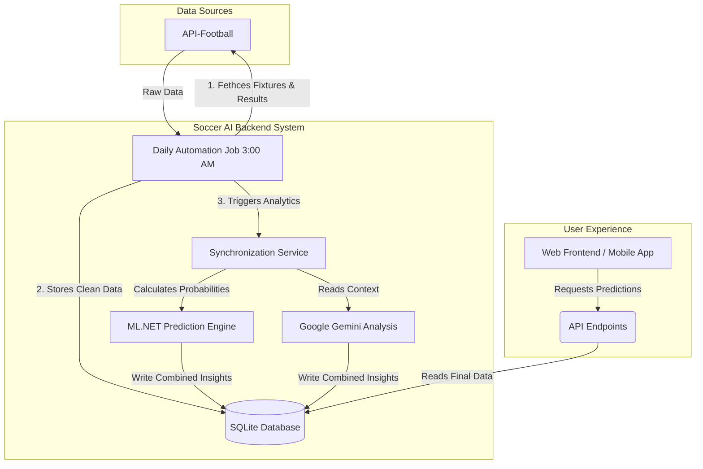

# Soccer AI - API Documentation

Welcome to the internal system architecture documentation for Soccer AI! Below is a high-level explanation of how the platform operates on a daily basis.

---

## High-Level System Flow (Visual Diagram)

The following diagram illustrates how raw football data is transformed into AI-generated predictions without requiring any developer intervention:

---

## Core API Capabilities

The backend exposes several distinct "areas" of endpoints that the frontend App can safely query:

### 0. Picks (`/api/picks`) — the product surface

`GET /api/picks?date=YYYY-MM-DD&language=en`

Returns the day's stakeable output in four parts:

| Field | Meaning |
|---|---|
| `singles` | One qualified selection, priced above its market floor. |
| `same_match_pairs` | BTTS + Over 2.5 on the same fixture, priced off the true joint probability. Rescues a fixture the model likes but the book prices below the single-bet floor. |
| `combos` | Two- to three-leg accumulators. BTTS/Over 2.5 tickets get guaranteed slots. |
| `confidence_picks` | Product 2: the most likely market per fixture, no odds required. |
| `coverage` | How many of the day's fixtures could be analyzed and priced. |

Two properties are worth stating plainly:

1. **Selection runs through `PickSelector`, the same component the backtest
   uses.** Published picks and measured picks are the same code path, not two
   implementations that agree by inspection.
2. **No language model participates.** Probabilities come from Dixon-Coles plus
   calibration; selection comes from the confluence gate and EV maths.

On `confidence_picks.model_probability`: it is the maximum across several
market estimates, and a maximum sits above the average of what it was chosen
from, so it reads high. Publish the measured bucket hit rates from the backtest
report instead.

Each market is filtered against its own floor
(`Confluence:ConfidencePickMinProbabilityByMarket`) *before* the best is chosen,
so a suppressed market cannot win the comparison and then be dropped, taking a
publishable pick from another market down with it. Over 2.5 currently sits at
0.65: baseline v9 measured the confidence-selected 60–65% band hitting 48.8%
(n=41) while the same band across all fixtures hit 66.7% (n=123).

`GET /api/picks/performance?from=YYYY-MM-DD&to=YYYY-MM-DD`

What published tickets actually returned — live results at the prices customers
were shown, not a simulation. Broken down overall, by ticket kind and by market.

The ledger behind it holds three rules that keep the record honest:

- **Prices are frozen at publication.** Re-reading odds at settlement would
  measure the closing line instead of the price shown, which always flatters.
- **Void is not loss.** Abandoned fixtures, and extra-time results whose
  90-minute score cannot be recovered, are excluded from ROI rather than
  guessed at. A void leg voids the whole ticket rather than re-pricing the rest,
  because the reduced ticket is not the one that was published.
- **Every slice reports `sample_too_small`.** Below thirty settled tickets, ROI
  is dominated by variance. Do not put such a number on a landing page.

### 1. Automation (`/api/automation`)
Automates the system background state.
- **Sync Daily Data**: Pulls yesterday's results to determine if predictions won or lost. Next, it downloads today's active fixtures.
- **Trigger Analytics**: Processes the ingested matches using mathematical probability (Poisson distribution) and Machine Learning (ML.NET). Generates human-readable context utilizing Google Gemini.

### 2. Analysis (`/api/analysis`)
Fetches detailed statistics for individual matches.
- Returns comprehensive data including historical Head-to-Head metrics, expected goals per team, defensive statistics, and algorithmic win-probabilities.

### 3. Combinations & Tickets (`/api/combinations`)
Legacy shape of the same board served by `/api/picks`, kept for existing clients.
- Selection is statistical: Dixon-Coles → calibration → confluence gate → `TicketBuilder`.
- It previously delegated selection to a language model, which produced parlays that could not be backtested and returned nothing when no model API key was configured. New clients should use `/api/picks`.

### 4. Backtesting (`/api/backtest`)
Analyzes the ML models against the real world.
- Looks exclusively into the past to recalculate how accurately the platform's models predicted games that *already happened*, providing transparency and confidence scores for future predictions.

### 5. Leagues (`/api/league`)
Provides catalog data on all supported international leagues, standardizing Team names, IDs, and League Codes across the entire data-set.

### 6. Authentication (`/api/auth`)
Secures the platform using JWT (JSON Web Tokens). Only properly authenticated administrators can trigger systemic syncs or wipe data.
