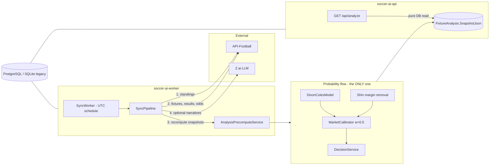

# Soccer AI API

Backend for statistical soccer match analysis: a Dixon-Coles Poisson model produces
market probabilities, bookmaker odds calibrate them, and an LLM adds narrative text
(never probabilities). Includes a REST API, a dedicated sync worker, and an
operational CLI.

## Architecture



Clean Architecture: `soccer-ai-application` (domain + use cases, no infrastructure
references) ← `soccer-ai-infrastructure` (EF Core, API-Football, LLM client) ←
`soccer-ai-api` (HTTP), `soccer-ai-worker` (sync agent), `soccer-ai-tools` (CLI).

## The model (single probability source)

**Dixon-Coles Poisson** (`DixonColesModel` + pure-math `DixonColesMath`):

1. Team attack/defense strengths from ALL seasons with exponential time decay
   (half-life 180 days — no hard season cut), venue blending 70/30, Bayesian
   shrinkage toward league average on the decay-weighted sample size.
2. λ_home, λ_away → DC-adjusted score matrix (τ correction for 0-0/1-0/0-1/1-1,
   ρ = −0.13), renormalized to sum exactly 1, max 8 goals per side.
3. ALL markets (1X2, Over/Under 2.5, BTTS, 2-3 goals) are read from that same
   matrix — no independent side formulas.
4. Calibration: `final_p = 0.5 × p_DC + 0.5 × p_market`, where p_market comes from
   Shin-margin-removed odds (3-way for 1X2, 2-way for O/U). Weight configurable
   (`Calibration:MarketWeight`). Markets without odds stay pure model.

All constants live in typed options (`DixonColes`, `Calibration` config sections).
The LLM only ever generates narrative text. ML (`train-ml`) is preparation only:
leak-free fixture-market rows, temporal train/test split, Brier/log-loss/calibration
evaluation harness.

## Requirements

Environment variables (or Render secrets):
- `ApiFootball__ApiKey` (or `API_FOOTBALL_KEY`) — API-Football key
- `ZAI_API_KEY` or `AiService__ApiKey` — LLM key (optional; narratives off by default)
- `Jwt__Secret` — JWT signing secret
- `DATABASE__PROVIDER` — `Postgres` or `Sqlite` (default `Sqlite`)
- `CONNECTIONSTRINGS__POSTGRESCONNECTION` — when using Postgres
  (keyword syntax or `postgres://` URL — both accepted)

## Run locally

```bash
dotnet build soccer-ai-api.sln
dotnet test

# API (applies EF migrations on startup)
dotnet run --project src/soccer-ai-api/soccer-ai-api.csproj

# Sync worker (UTC schedule from Sync:ScheduleUtc; startup sync only if >20h stale)
dotnet run --project src/soccer-ai-worker/soccer-ai-worker.csproj

# Everything incl. PostgreSQL:
docker compose up --build
```

## CLI (soccer-ai-tools)

```bash
dotnet run --project src/soccer-ai-tools -- backtest [--weeks=10] [--stake=1.0]
dotnet run --project src/soccer-ai-tools -- train-ml [--cutoff=2026-03-01]
dotnet run --project src/soccer-ai-tools -- sync-league --league=39 [--season=2026]
dotnet run --project src/soccer-ai-tools -- sync-ai [--fixture-id=123] [--force]
dotnet run --project src/soccer-ai-tools -- sync-full [--season=2026]
dotnet run --project src/soccer-ai-tools -- migrate-data [--sqlite=data/soccer.db] [--postgres=<conn>]
```

`migrate-data` is the one-time zero-loss SQLite → PostgreSQL migration: read-only
source, single transaction, per-table row counts + SHA-256 spot checks, aborts on
any mismatch.

## Database & migrations

- **PostgreSQL** is the primary provider (`Migrations/Postgres`, bound to
  `PostgresDbContext`).
- **SQLite** migrations are frozen in `Migrations/SqliteLegacy` (bound to
  `ApplicationDbContext`) — the providers never see each other's migrations.
- New schema changes: add the property, then generate a migration per provider
  with `dotnet ef migrations add <Name> --context <Context>`.

## Deployment (Render)

`render.yaml` provisions the API (web), the sync worker (worker), and the managed
PostgreSQL database; both services read the database connection string via
`fromDatabase`. Set `API_FOOTBALL_KEY` / `ZAI_API_KEY` in the dashboard.
